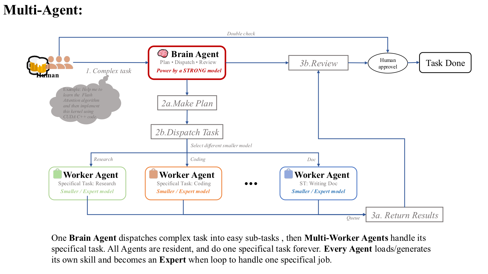
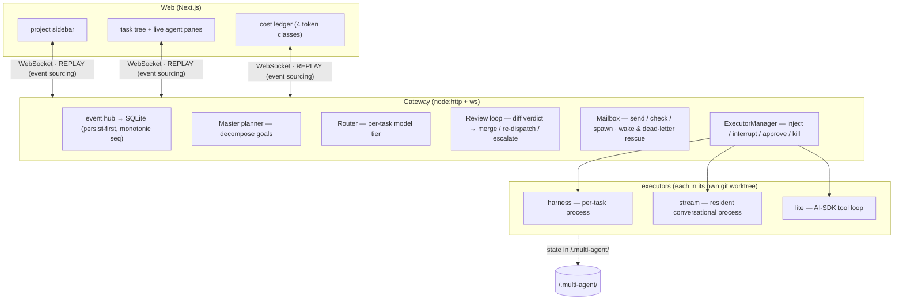

# Multi-Agent Workbench

**A local orchestration workbench where a resident master brain, a pool of specialist agents, and a human operator together tackle large, complex tasks that no single session could hold — with fine-grained task decomposition, full inspectability, and every token accounted for.**

## 1 · Why this exists

The real bottleneck in serious work is not model intelligence — it is **bandwidth in one head**. A single agent session drowns: context fills, history compresses away, parallel opportunities go unexploited, and one crash loses everything. It started from a working observation: one agent *can* carry every skill at once, but it works far better to open several agents and give each a single skill of its own — a complex undertaking then falls apart naturally into small tasks, one per domain, each handled by its resident specialist. What a solo operator needs is such a *team* — the workbench builds one:

- **A resident master brain** — a planner that decomposes your goal into a dependency-ordered task tree, dispatches each subtask to the agent best suited for it, reviews the actual diffs, and re-dispatches or escalates on failure. It stays resident across the session, so the plan's state survives every individual run.
- **Resident specialist agents** — the opposite of one generic worker that carries every skill: each agent is given a single domain and stays in it, task after task. Whatever skill that domain needs, the agent grows it by repetition — it does not have to be scripted in advance. They talk to each other through a mailbox (send / check / spawn) and can be addressed by name.
- **The human as a first-class operator** — watch every agent's stream live, steer any of them mid-turn (inject / interrupt / approve risky tool calls), and revive a stopped agent from its persisted session with full memory, same identity. The operator commands the fleet; the master brain runs the details.

The shape of a working session: **one brain agent decomposes a complex undertaking into small, tractable tasks — and each resident worker agent owns exactly one domain of the work.** A big engineering effort splits naturally along skill lines; every agent specializes in its own line and masters it. No skill has to exist up front: agents grow their specialty by doing — each pass over the same kind of job sharpens it a little further — until each one is simply the resident expert in what it does:

<p align="center">
  
</p>


One rule stays constant in that picture: **nothing finishes on the agents' say-so** — the brain checks the work, and only your approval closes a task. And every agent, brain included, stays within your reach — steerable directly by your prompt at any moment.

Design consequences follow from this goal, not from cost-cutting:

- **Task decomposition is the unit of work.** Goals become task trees with real dependency edges; workers run concurrently on independent branches; the review gate decides what enters your project.
- **Inspectable, not trusted.** Every agent works in its own git worktree; the master reviews content-level diffs (not "trust me" reports); every event persists with a monotonic sequence and rebuilds any client from zero. A specialist that misbehaves is visible, bounded, and reversible.
- **Model-agnostic by construction.** Which model serves the planner tier and which serve the worker tiers is pure `.env` configuration — the code knows tiers, not vendors. Point it at any OpenAI-compatible endpoint.
- **Local-first.** Runs entirely on your machine; all state — SQLite history, worktrees, sessions, cost ledger — under the opened project's `.multi-agent/` directory; switching projects is a ~0.2s hot rebind.

The codebase doubles as a live experiment in **self-implementation**: several real bugs in this workbench were diagnosed and fixed by agents dispatched from the workbench itself, merged through its own review loop (see `git log` — the "roster doctor" and "usage-tracking" commits).

## 2 · Getting started

Requirements: Node 22+, pnpm, git. Models: any OpenAI-compatible endpoint(s); a planner tier plus one or more worker tiers is recommended, a single model works too.

```bash
git clone https://github.com/kalenforn/multi-agent.git
cd multi-agent && pnpm install

# secrets stay in .env (gitignored) — fill in YOUR model endpoints:
# <TIER>_API_KEY / <TIER>_BASE_URL / <TIER>_MODEL per tier
cp .env.example .env

# start gateway + web (dev)
pnpm dev                # or: pnpm dev:gateway & pnpm dev:web &

open http://localhost:3000
```

The UI:

1. **Open a project** — the 📂 button raises your OS folder picker (macOS for now; the packaged app swaps in its own dialog). Everything the workbench produces — SQLite state, per-task git worktrees, cost ledger — lives under `<project>/.multi-agent/`, auto-gitignored. Switching projects is a hot rebind, no restart; every opened project stays on the sidebar.
2. **Submit a goal** — empty input spawns a standby agent you talk to; or pick a mode:
   - **Master orchestration** — the planner decomposes your goal into a task tree, routes each subtask to the best-fit worker tier, reviews diffs, squash-merges accepted work.
   - **stream / harness / lite** — a single agent directly (long-lived conversational, task-shaped, or lightweight tool-loop).
3. **Operate** — each task row shows a live status light (yellow = waiting, breathing green = working, red = stopped), four-line identity (name / agent id / model / state), and inline controls: inject a prompt mid-turn, interrupt, approve risky tool calls from a global queue, rename agents (✏️), and wake stopped agents from their persisted sessions (⚡).
4. **Watch the money** — the right panel stacks per-task token bars in four classes (fresh input / output / cache hits / cache writes); totals poll live.

Configuration: all tunables (parallelism, timeouts, message caps, idle windows, budget caps) live in [`packages/gateway/config.json`](packages/gateway/config.json) — env vars (`MAW_*`) override, secrets never leave `.env`.

## 3 · Architecture



Key properties:

- **Event sourcing** — every agent event is persisted with a monotonic seq before broadcast; any client can replay the full history since 0. Reconnects and refreshes are lossless.
- **Roster supremacy** — one state machine (`agentPhase`) drives the indicator lights, input gating and status text, fed by the gateway's live roster. No dual state to disagree.
- **In-place revival** — an agent's session id is persisted at spawn; a stopped agent revives with the same id via `--resume`, keeping panels, subscriptions and its full memory intact.
- **Crash containment** — uncaught exceptions reap every executor before dying; a boot-time sweep kills any agent processes orphaned by a previous crash.
- **Anti-ping-pong protocol** — reports are one-way, acknowledgment messages are forbidden, broadcasts never wake idle agents: conversations converge instead of burning paid turns.

More depth: [docs/ARCHITECTURE.md](docs/ARCHITECTURE.md) (components/sequences/ER) · [docs/TECH_STACK.md](docs/TECH_STACK.md)

## 4 · Acceptance tests

Each day of the build has a scripted acceptance test (run against a fresh DB; tier-suffixed variants hit real models):

```bash
pnpm smoke          # D1  DB schema
pnpm test:d2        # D2  WS hub replay + control plane
pnpm test:d3:<tier> # D3  lite executor (real model)
pnpm test:d4:<tier> # D4  harness executor
pnpm test:d5        # D5  inject / interrupt / approve
pnpm test:d6        # D6  Master decomposition
pnpm test:d7        # D7  review loop
pnpm test:d7.5      # D7.5 agent-to-agent comms
pnpm test:d8        # D8  milestone-A full chain
```

## 5 · Others:

If you want to develop this project, feel free to concat me.
