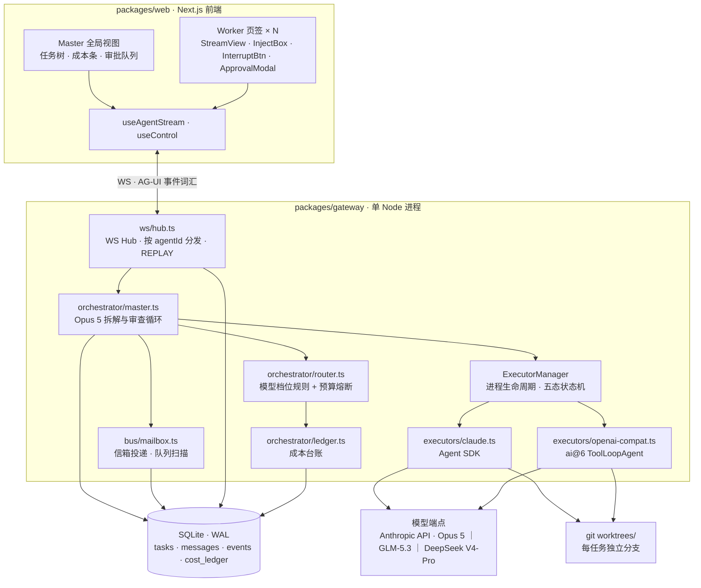
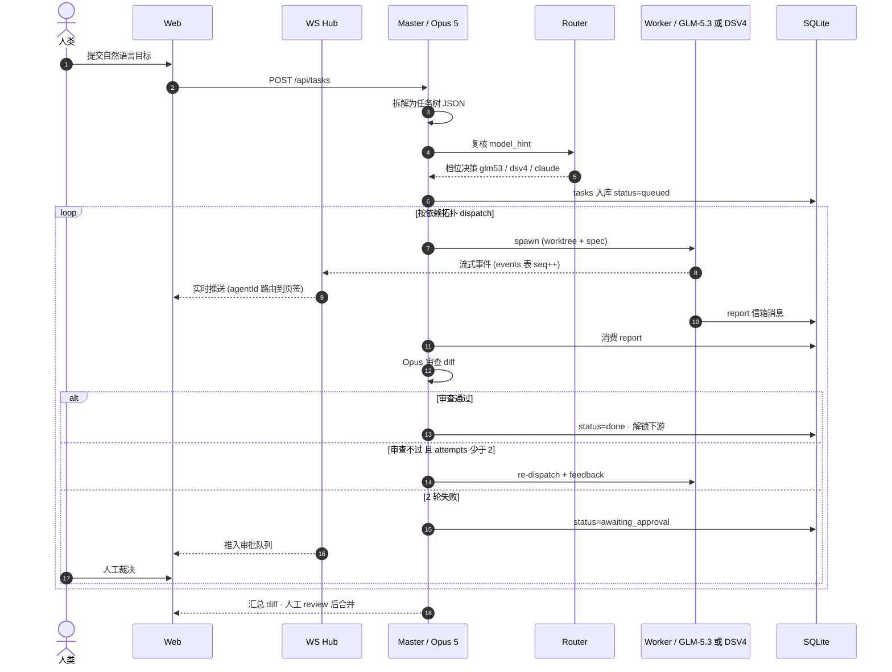
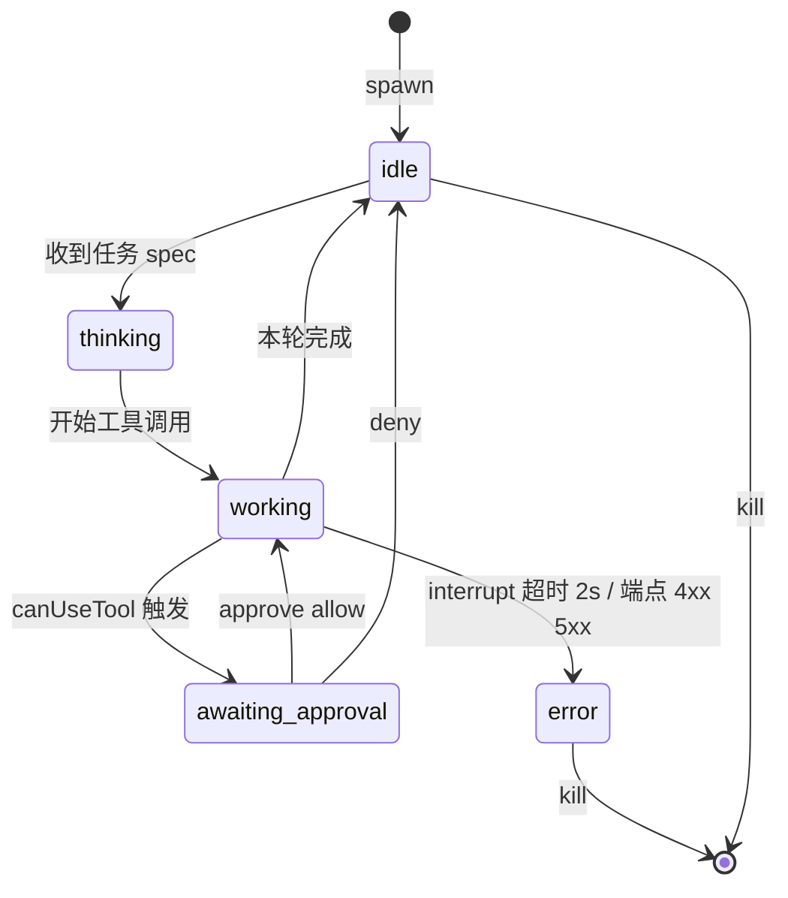
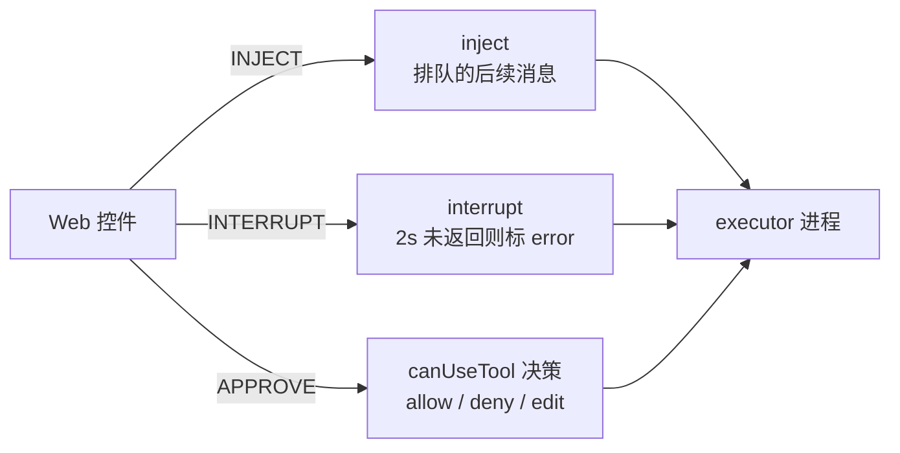
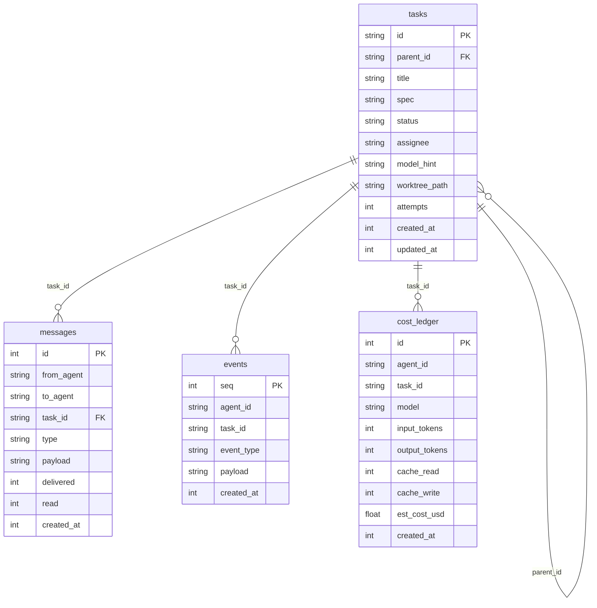
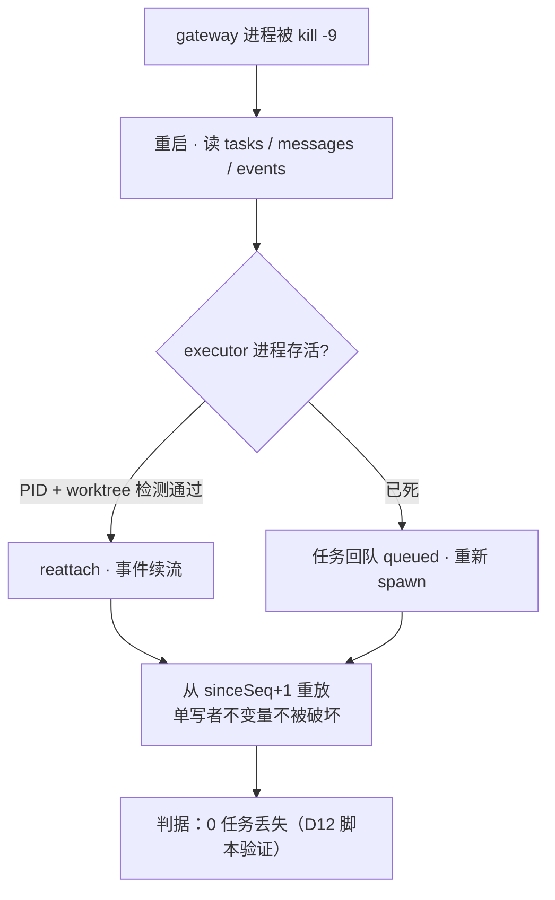

# Multi-Agent Workbench — 架构图（v1，待评审定稿）

> 对应 `plans/multi-agent-workbench-mvp/PLAN.md`（路线 C）。本文件是架构的图示化说明，
> 与计划五节内容一一对应；评审通过后即为定稿基线，修改需回写计划并加 Revision。

## 0 · 设计不变量（看图前先看这 5 条）

1. **单 gateway 进程**：WS Hub / 编排 / 执行器管理 / 信箱全在一个 Node 进程内，MVP 不做分布式。
2. **单写者 DB**：所有写经主线程写队列（better-sqlite3 同步调用），任意时刻至多 1 个写者。
3. **事件溯源**：一切 agent 输出先落 `events` 表（单调 `seq`），WS 只是广播层；断线/崩溃都靠重放恢复。
4. **ExecutorAdapter 是唯一扩展点**：新增 OpenCode/Aider/PTY 兜底只加 adapter，不碰总线、UI、编排。
5. **AG-UI 只当词汇表**：TS 类型本地持有，不硬依赖其 pre-1.0 运行时；换协议只改 adapter 层。

## 1 · 图 A：系统组件图

要点：前端只经 1 条 WS 连接拿全部事件（按 `agentId` 分流到页签）；gateway 内组件间不跨进程；
模型端点与 worktree 只被 executor 层触碰（编排层不直接碰文件系统）。

## 2 · 图 B：端到端任务生命周期

要点：审查循环是唯一的任务状态出口（不变量：每个 running 任务必经
done / queued / failed / awaiting_approval 之一离场）；人不在循环里当搬运工，只在 3 个位置介入——
审批队列、页签干预、最终合并。

## 3 · 图 C：执行器控制面与五态状态机

要点：两个执行器（claude.ts / openai-compat.ts）实现同一个 `AgentHandle` 接口，
控制三件套语义一致；坏 JSON 时带修复提示重试一次再失败即升级人工。

## 4 · 图 D：数据模型（ER）

要点：4 张表同库同事务；`events.seq` 单调递增是 WS 重放与崩溃恢复的锚点；
`cost_ledger` 的 per-task 归因直接支撑 D13 基准的成本对比。

## 5 · 图 E：崩溃恢复

## 6 · 关键决策记录（评审时重点确认）

| # | 决策 | 理由 | 不同意的后果 |
|---|---|---|---|
| 1 | WS 单通道 + AG-UI 词汇表 | 避免自发明协议；类型本地持有防绑定 | 换协议需重写前端事件层 |
| 2 | 单写者 SQLite（WAL） | 14 天内可交付的崩溃恢复最简路径 | 上量后迁移 Postgres+pgmq（接口已预留） |
| 3 | Claude 走 Agent SDK、GLM/DSV4 走 ai@6 | 各自控制面五要素零成本 | Agent SDK 不可用时降级 headless CLI stream-json |
| 4 | MVP 不引入 CCR | 只有 2 条接入路径，自研 gateway 更透明 | 多 CLI 混编时再加 CCR adapter |
| 5 | 仅 API-key 计费 | Anthropic ToS 禁订阅 OAuth（2026-02 起） | 违规封号，不可逆 |
| 6 | 信箱模式 agent 间通信 | 抄 Claude Code mailbox 已验证结构；人机指令同表 | 引入独立 MQ 则 MVP 复杂度超标 |

## 6.5 · D11/D12 补充机制（实现后回写）

- **预算闸**（D11）：每次 dispatch 前 `enforceBudget` 读真实 cost_ledger——
  任务花费 >60% 上限 → 强制降 dsv4；超限/全局耗尽 → 任务置 blocked + 人工通知。
  上限：`MAW_TASK_TOKEN_CAP`（默认 500k）/ `MAW_GLOBAL_TOKEN_CAP`（默认 5M）。
- **崩溃恢复**（D12）：gateway 启动时扫 running 孤儿任务 → 回队 queued →
  dispatchReady 重派（worktree 文件存活复用）。实测 kill -9 → 0 丢失。
- **spawn_agent**（第四路径）：任意 agent 可开新 worker，护栏见 TECH_STACK §6。
- **模型调用超时**：lite 档 `MAW_MODEL_TIMEOUT_MS`（默认 300s）——网关拥塞时
  Worker 不再无限挂起。

## 7 · 评审清单

- [ ] 图 A 组件边界：gateway 单进程是否可接受（vs. 独立 worker 进程池）
- [ ] 图 B 审查循环：自动 re-dispatch 2 轮上限是否合适（OPEN 项 3）
- [ ] 图 C 控制三件套语义是否覆盖你的干预需求
- [ ] 图 D 4 表 schema 字段是否够用（缺什么现在加）
- [ ] 图 E 崩溃恢复判据（0 任务丢失）是否过严/过松
- [ ] OPEN 项 1–3 与 BLOCKED-ON（三家 API key）需你拍板

评审通过后：本文件与计划对升 Revision 2，架构即定稿。
